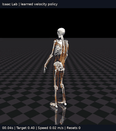

# MuscleMimicをIsaac Labへ移し、筋駆動の歩行を学習するまで

この文書は、モデルの読み込みから歩行学習までに何を試し、何が問題になり、どこまで到達したかを説明する実験報告です。実行手順は[README](../README.md)、終了時の数値は[RESULTS](../RESULTS.md)を参照してください。過去のメモに残る「学習中」「未検証」は、その時点での記述です。本実験はrun_026の最終評価を終えて区切っています。

## 1. 今回できたことと、残ったこと

MuscleMimicの筋骨格モデルをIsaac Lab＋Newton＋MuJoCo Warpで動かし、筋の興奮度を出力するPPO方策を学習しました。最終的に、**外力補助を使わずに左右の足を交互に接地して歩く方策**を得ました。保存した方策は、直立状態から始める20秒評価で、停止・0.4・0.8・1.2 m/sの各指令に対して97%以上の生存率を示しました。

一方、**低速指令に対して速く歩きすぎる問題が残っています**。立ち続けること、交互に歩くこと、指令速度に正確に追従することは別の達成条件でした。今回確認したのは、筋駆動モデルの移植と交互歩行の獲得までであり、汎用的な速度追従制御器の完成や原論文の性能再現ではありません。

配布する重みには最終run_026ではなく、記録済み評価の生存率と速度誤差のバランスがよかった**run_025の5716更新時点**を選びました。

## 2. 何をIsaac Labへ移したのか

処理の流れは次のとおりです。

```text
PPO方策 → 筋の興奮度 → 独自の筋骨格環境
                         ↓
Isaac Lab SimulationContext
  → 独自NewtonMJWarpManager → SolverMuJoCo → MuJoCo Warp（GPU物理）
                         ↓
               観測・報酬・終了判定 → PPO更新
```

MuJoCo Warpは、MuJoCo系の物理計算をWarpでGPU実行するバックエンドです。この構成ではNewtonのMuJoCoソルバー経由で利用します。元のMuscleMimicのMJX/JAX実装や、Isaac LabのPhysXバックエンドで物理を計算しているわけではありません。

筋はMuJoCoの筋アクチュエータが持つ長さ・速度依存の力、受動成分、活性化ダイナミクスを使います。Hill型筋モデルのGPUカーネルを独自に書き直したのではなく、モデルのパラメータとspatial tendonの経路をMuJoCo Warp側へ正しく渡す方針です。モデルはMJCF/XMLに加え、メッシュなどの外部アセットを参照します。

読み込み検証は**416筋・424腱の全身モデル**で行いました。その後の学習は指の自由度を無効化した**354筋、nq=89、nv=88**の構成です。両者の筋数や計算速度を混同しないようにする必要があります。

Isaac Labとインストール済みNewtonのソースファイルは変更せず、外部アダプターで対応しました。ただし内部の拡張箇所に依存する試作実装であり、標準のArticulationやGym登録済みManagerBasedRLEnvにそのまま載った環境ではありません。確認したIsaac Labは**3.0早期アクセスの固定コミット**です。任意の「3.0.0」環境での互換性を意味しません。

## 3. 導入で問題になったのはspatial tendonだけではなかった

spatial tendonを扱えるバックエンドを選ぶことは必要でしたが、それだけでは元モデルの挙動を保てませんでした。汎用インポーターを通す過程で、筋・拘束・接触・観測の情報を失わないことが重要でした。

| 問題・症状 | 対応 | 確認した範囲 |
|---|---|---|
| メッシュ参照や名前の変換により腱のsite参照が合わない | アセットパスを解決し、ハイフンを含む名前と参照を正規化。質量・慣性を明示 | モデル読み込み、腱・アクチュエータ対応 |
| muscleのdefault指定がそのまま伝わらない | 筋のgain/bias/dynamicsを明示的なgeneral actuatorパラメータへ展開 | 元モデルとのパラメータ比較 |
| 関節間の多項式拘束が汎用変換で失われる | スカラー自由度の対応から51個のjoint equalityを再構成し、高次係数も保持 | 拘束数・係数・対応関係 |
| GPU側の筋の長さ範囲がゼロになり、力が発散してNaNになる | 初期化・モデル更新後にGPUの`actuator_lengthrange`を復元 | ランダム駆動中の有限値、筋力、選択環境の活性化リセット |
| 接触margin/gapが元のモデルと変わる | CPUのspecだけでなく、Newtonのモデル更新後のGPU配列にも再設定 | 元の1 mm marginなどを復元し、MJXとの初期遷移を比較 |
| センサーが欠落し、観測の取得時刻もずれる | 110センサーを復元。接触・運動学情報をGPUから元の観測処理へ渡す | 初期観測と1ステップ後の誤差を検査 |

初期姿勢の筋長にはnative MuJoCoとの差が最大0.271 mm残りました。読み込み・有限値チェックの成功を、完全な幾何一致や長時間軌道の一致とは扱っていません。

詳細は[アダプターと移植検証の記録](../examples/isaaclab_newton_fullbody/README.md)にあります。このファイルには初期段階の制限も残っているため、現在の学習・推論の入口はトップのREADMEを使ってください。

## 4. mjlabで先に検証したこと

mjlabではモデル読み込み、ランダムな筋駆動、GPU並列実行を確認しました。筋骨格モデル自体がMuJoCo Warpで実行できるかを切り分ける検証先として役立ちました。今回の歩行PPOをmjlab上で学習したわけではありません。

RTX 5090・416筋モデルでの測定結果は次のとおりです。

| 並列数 | 物理env-steps/s | 制御env-steps/s |
|---:|---:|---:|
| 4096 | 131,645 | 26,329 |
| 8192 | 139,667 | 27,933 |

8192環境への増加による向上は約6.1%で、2倍にはなりませんでした。この測定は物理計算・ランダム興奮度の設定・GPU上の異常監視を含みますが、PPO更新・報酬・描画・リセットは含みません。物理刻み2 ms、制御間引き5、implicitfast、solver 50/line-search 20という条件も後のIsaac Lab学習と異なります。**この数値をIsaac Labの学習速度や論文の学習速度と直接比較することはできません。** [設定と測定データ](../validation/mjlab/README.md)を保存しています。

## 5. 元の事前学習済み方策を移した比較

最初は原実装のJAX方策・観測処理を利用し、物理部分をIsaac Lab側に置き換えて歩行を試しました。十分に歩けなかったため、同じチェックポイントと参照動作を元のMJXでも実行し、初期状態をそろえて比較しました。

接触設定、センサー、観測時刻などを修正すると、10 ms後の最大一般化座標誤差は0.00261から8.64×10⁻⁷、最大一般化速度誤差は0.787から0.000147、観測のRMS誤差は1.218から0.000901へ減少しました。一般化座標は並進と回転を含むので、この数値を単一の距離誤差とは解釈できません。

修正後の30秒比較では、元MJXが12回、Isaac Labが11回リセットしました。つまり、**今回選んだチェックポイント・コード・モデル・参照動作の組み合わせでは元MJXも安定歩行を維持できませんでした**。転倒をすべて移植のせいにすることも、移植が完全に同一挙動になったと判断することもできません。

骨盤や頭への上向きの一定力も試しました。これは体重の一部を支える補助であり、自力歩行とは区別しました。後の学習では姿勢を保つためのPD補助も試しましたが、補助付きで長く立てることは、補助を外して歩けることを保証しませんでした。

## 6. 学習で試したことと判断

### 6.1 速度追従とG1型報酬だけでは、歩くより立つ方策になった

速度追従、姿勢、片足支持時間、足滑りを骨組みにし、遊脚高さが5 cmに近いと加点する項や、左右交互の着地を評価する項を加えました。すり足、跳躍、片足を上げ続ける動作を抑え、単なる生存率だけで判断しないようにしました。

初期のG1系run_005では立位を保つ方策が得られましたが、交互歩行にはなりませんでした。確率的行動と平均行動でも挙動が異なり、探索ノイズ込みで安定していることを、決定論的な制御の安定性と同一視できませんでした。なお、旧`isaac_velocity/run_007`とG1系列のrun番号は別系統であり、旧実験は停止したままです。

### 6.2 補助・模倣・行動次元の変更を試したが、立位や胴体の折れ込みが残った

| 実験群 | 主な狙い・変更 | 観察と判断 |
|---|---|---|
| run_008–010 | 凍結した立位方策への低次元残差、脚関節参照、骨盤PD補助 | 静止や補助による移動が中心。自力の交互歩行は得られず |
| run_011–012 | 全354筋を学習し、歩行参照から初期化。参照データの拘束整合性を修正 | 不正な初期値は修正できたが、補助なしの胴体折れ込みは解消せず |
| run_013–016 | 頭への体重30%補助、4調波の位相入力分岐、Cartesian模倣、PPOのKL目標変更 | 立位の改善が見える場合もあったが、連続した交互着地につながらず |
| run_017–018 | 外力ゼロ。全筋学習と、凍結方策への80筋の脚残差を試行 | 立位からの悪化、短時間の転倒が続いた |
| run_019–020 | 模倣報酬を正の類似度に変更。脚残差と全筋の両方で検証 | 初期の立位は改善したが、継続した歩行を獲得するには不足 |

この過程で二つの実装上の問題を見つけました。

一つは**参照リセット状態と関節拘束の不整合**です。参照データの膝の多項式拘束に最大0.478 rad、速度に2.944 rad/sの残差がありました。独立座標を保ち、従属関節の位置と速度を拘束式に従って再計算し、残差を数値精度程度まで下げました。ただし、これだけで歩行が成功したわけではありません。

もう一つは**模倣報酬から立位の基準点を引く設計**です。固定長なら定数の差に見えても、早期終了がある環境では、生存中の報酬を負にすることで継続の価値を変えます。そのため基準点を引かない正の類似度へ変更しました。「方策が意図して転倒した」と証明したのではなく、報酬設計に不適切な誘因が入り得る点を修正したものです。

関節角だけでなく、骨盤に対する身体各部の相対位置を比較するCartesian報酬も導入しました。参照周期は、リセット用に選別した一部のフレームからではなく、拘束を補正した全周期から作りました。位相境界の連続性、GPUで求めたsite位置、CPUとの報酬一致を確認しました。

[run_011–020の詳細メモ](../examples/isaaclab_newton_fullbody/EXPERIMENT_STATUS.md)には、この時点の診断・中断判断を残しています。複数の変更を同時に含む実験もあり、各改善を一つの要因だけに帰属することはできません。

### 6.3 run_021：立位方策の継続をやめ、ゼロから歩行を学習

転機になったrun_021では、旧方策から再開せず、全354筋の方策を新規に学習しました。主な条件は以下です。

- 外力補助ゼロ、目標速度1 m/s固定、エピソード10秒。
- 初期化の80%は拘束を補正した歩行参照、残りは直立。
- 正のCartesian報酬17.5、体幹高さ報酬5、関節角模倣報酬0。
- 方策に4調波の位相分岐。探索の初期標準偏差0.5を学習し、旧方策の0.15への制限を引き継がない。
- PPOのKL目標0.2、4096並列環境、2000更新。

1 m/s・直立開始・外力ゼロの別評価では、256環境中90.6%が20秒を完走し、平均継続時間18.90秒、速度MAE 0.202 m/sでした。96.1%の環境で4回以上の連続交互着地を確認しました。代表動画も20秒間リセットなしで歩きました。[この評価の数値](../results/run_021/upright_speed1/metrics.json)を同梱しています。

この評価は後述の4096環境・4指令評価とは条件が異なります。また、run_021の通常評価に含む0・0.4・0.8・1.2 m/sは、固定1 m/sの学習条件と一致しません。まず1 m/sで歩けるかを確認し、その後に速度範囲を広げました。

### 6.4 run_022–026：速度範囲と停止へ広げる

| run | 開始元 | 主な変更 | 結果・次の判断 |
|---|---|---|---|
| 021 | 新規 | 1 m/s固定、歩行獲得を優先 | 交互歩行を獲得。低速・停止は未獲得 |
| 022 | 021 / 1999 | 指令0.8–1.2 m/s、参照リセット80→50% | 移動は安定するが、停止と低速が弱い |
| 023 | 022 / 2840 | 指令0.4–1.2 m/s、停止指令の設定確率0.1 | 生存率は向上。0.4指令でも代表動画の平均速度は約0.83 m/s |
| 024 | 023 / 3840 | Cartesian報酬17.5→8.75 | 低速誤差を減らす傾向。ただし停止の安定性は学習中に変動 |
| 025 | 024 / 4716 | 停止指令の設定確率0.1→0.3 | 5716更新を配布用に選定。生存率と速度誤差のバランスが良好 |
| 026 | 025 / 5716 | 学習エピソード10→20秒 | 最終評価で停止は改善。低速追従は改善せず、ここで実験を終了 |

参照リセットでは指令が参照側の値に置き換わるため、設定した停止確率は全リセットでの停止比率とは異なります。参照リセット50%の場合、設定0.1/0.3は全体では約5%/15%に相当します。

run_026では、10秒の学習では捉えにくい後半の転倒を改善するため、学習時間上限を延ばしました。ただし最終結果は「長く学習すればすべて改善する」というものではありませんでした。停止安定性と移動時の速度精度には異なる変化が見られました。各runの設定・評価は[results](../results)に保存しています。

## 7. 保存した方策と最終方策の比較

以下は、4096環境を4指令へ各1024環境ずつ割り当てた20秒評価です。直立開始、ランダム位相、初期速度摂動0.02、確率的方策、外力補助ゼロという条件です。

| 指令 m/s | 選定025 / 5716 生存率 | 同 速度MAE m/s | 最終026 / 6716 生存率 | 同 速度MAE m/s |
|---:|---:|---:|---:|---:|
| 0.0 | 97.66% | 0.059 | 100.00% | 0.047 |
| 0.4 | 99.90% | 0.277 | 99.80% | 0.358 |
| 0.8 | 100.00% | 0.140 | 99.80% | 0.189 |
| 1.2 | 99.51% | 0.162 | 97.17% | 0.153 |

生存率は最初のエピソードで20秒を完走した割合です。速度誤差だけでは短時間で倒れる方策も良く見える場合があるので、生存率・足の接地・動画と合わせて判断しました。

選定基準は「4指令すべての生存率が97%以上の記録済み評価のうち、4指令を等重みで平均した速度MAEが最小」です。選定run_025は約0.160 m/s、最終run_026は約0.187 m/sでした。これは実験後に決めた基準であり、独立した未使用データや複数seedによる最良性の検証ではありません。

選定方策の代表動画では、0.4 m/s指令に対して平均速度は約0.67 m/sでした。交互に歩けても、まだ指令より速いことが分かります。



[選定した重み・評価・軌道](../artifacts/best-policy/README.md)、[選定基準](../artifacts/best-policy/selection.json)、[最終評価JSON](../results/run_026/iter_006716/metrics.json)を参照できます。評価では実際の外力配列を検査し、全成分ゼロを確認しました。

動画はIsaac Lab＋Newtonで実際に計算した状態を記録し、MuJoCoでオフライン描画したものです。描画時に別の物理軌道を生成していません。Newtonのビューワーから直接録画する実装も別途検証しましたが、配布GIFはその画面録画ではありません。

## 8. 再実行できるように整理した内容

研究時のスクリプトには実験機固有のパスが含まれるため、新規学習・継続学習・推論の入口を`scripts/run.py`へまとめました。依存バージョンを固定し、モデルを`musclemimic_models`から検出し、必要な参照配列と選定チェックポイントを同梱しました。

配布物だけを別ディレクトリへコピーし、既存の固定バージョンIsaac Lab環境上で、GPU・4環境による新規PPO更新、保存重みの20秒推論、保存重みからの継続更新、動画生成を確認しました。これはコード経路とパッケージの検証です。小規模な2更新の学習が歩行を獲得したという意味ではなく、OS・ドライバを含めた新規マシンへの導入検証でもありません。[検証結果](../validation/portable/README.md)に範囲を明記しています。

同梱する参照配列は小規模な派生データです。利用時は[出典と利用上の制限](../artifacts/reference/README.md)も確認してください。

## 9. 今回得た知見と次に検証すべきこと

移植では、腱を計算できることに加えて、筋パラメータ、関節拘束、接触設定、観測の取得時刻を保つ必要がありました。CPUのモデルを修正しても、GPU初期化で再び上書きされる場合がある点が特に重要でした。

学習では、立位方策の継続、外力補助、模倣報酬の追加だけでは歩行に移れませんでした。拘束に整合する参照状態、正の模倣報酬、位相構造、十分な探索を組み合わせ、新規学習した条件で交互歩行を得ました。ただし、この組み合わせのどの要素が必要十分かは、比較実験で分離できていません。

残る課題は低速への過速度です。参照周期や歩幅を速度に応じて変えること、模倣報酬と速度報酬のバランス、停止と歩行の切り替えは次の検証候補です。加えて、長時間の連続動作、途中で変わる速度指令、決定論的方策、複数seed、物性のランダム化に対する頑健性は未検証です。初期位相・速度を変えた今回の評価だけで、広いdomain randomizationや実機への適用可能性を確認したとは言えません。

本リポジトリは、その先の研究を始めるために、動く実装、選定した重み、評価データ、成功しなかった試行の記録をまとめたものです。
